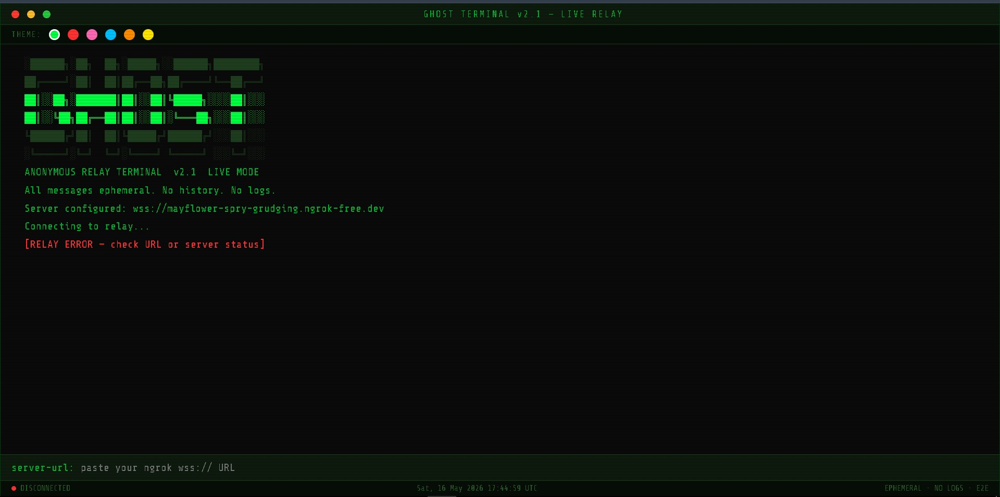
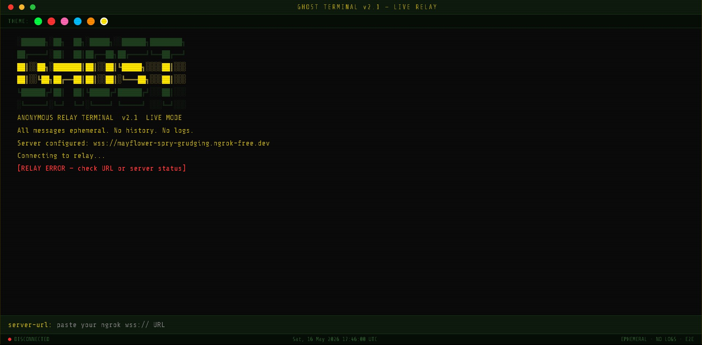

# 👻 GHOST TERMINAL

> Anonymous real-time terminal-style chat relay built with WebSockets.

<p align="center">
  
  
  
</p>

---

## ✨ Preview

> Replace these image links with actual screenshots of your website.

### Terminal Interface



### Theme Switching



### Live Chat


---

# 🧠 About

**GHOST TERMINAL** is an anonymous encrypted-style terminal chat application inspired by hacker aesthetics and retro relay systems.

It provides:

- ⚡ Real-time WebSocket communication
- 👤 Anonymous dual-user sessions
- 🖥️ Terminal-style interface
- 🎨 Multiple neon themes
- ⌨️ Typing indicators
- 🔒 Ephemeral conversations
- 🚫 No message history
- 🌐 Lightweight deployment

---

# 🚀 Features

## 💬 Real-Time Messaging

Instant low-latency communication using WebSockets.

---

## 🎨 Dynamic Themes

Users can switch between multiple terminal themes:

- Green
- Red
- Pink
- Blue
- Orange
- Yellow

---

## ⌨️ Typing Indicators

See when the other user is typing in real time.

---

## 🔐 Authentication System

Simple secure login system using predefined credentials.

---

## 🧹 Terminal Commands

| Command | Description |
|---|---|
| `/clear` | Clears terminal screen |
| `/quit` | Disconnects from session |

---

## 🕶️ Hacker UI

Built with:

- Scanline effects
- Neon terminal colors
- Live UTC clock
- Retro command prompts
- Animated message rendering

---

# 🏗️ Tech Stack

## Frontend

- HTML5
- CSS3
- Vanilla JavaScript

## Backend

- Node.js
- WebSocket (`ws`)

## Deployment

- Vercel (frontend)
- Any Node/VPS/Render backend

---

# 📂 Project Structure

```bash
ghost-terminal/
│
├── index.html        # Frontend terminal UI
├── server.js         # WebSocket relay server
├── package.json      # Dependencies
├── vercel.json       # Vercel routing
│
└── assets/
    ├── preview-1.png
    ├── preview-2.png
    └── preview-3.png
```

---

# ⚙️ Installation

## 1️⃣ Clone Repository

```bash
git clone https://github.com/yourusername/ghost-terminal.git
cd ghost-terminal
```

---

## 2️⃣ Install Dependencies

```bash
npm install
```

---

## 3️⃣ Start Server

```bash
npm run dev
```

Server will run on:

```bash
http://localhost:3001
```

---

# 🌐 Deployment

## Deploy Frontend on Vercel

```bash
vercel
```

---

## Deploy Backend

You can deploy the Node.js WebSocket server on:

- Render
- Railway
- VPS
- Cyclic
- Fly.io

---

# 🔌 WebSocket Configuration

Inside `index.html`:

```js
const DEFAULT_SERVER = "wss://your-websocket-server.com";
```

Replace with your actual backend URL.

---

# 🔒 Security Notes

This project is designed for lightweight anonymous chatting.

Current implementation includes:

- Basic authentication
- No message storage
- Ephemeral sessions

For production usage consider adding:

- JWT authentication
- HTTPS/WSS enforcement
- Database logging controls
- Rate limiting
- Encryption layers

---

# 📸 Screenshots

## Login Screen


---

## Active Session


---

## Theme Switching


---

# 🧪 Example Credentials

```txt
Username: ghost_alpha
Password: alpha@7749

Username: ghost_beta
Password: beta@3382
```

---

# 🛠️ Built With Love By

## Shaurya Rao

> “All messages ephemeral. No history. No logs.”

---

# ⭐ Future Improvements

- [ ] End-to-end encryption
- [ ] Group chat
- [ ] Temporary invite links
- [ ] Voice relay
- [ ] P2P communication
- [ ] File sharing
- [ ] Mobile responsive UI
- [ ] Matrix / TOR support

---

# 📜 License

MIT License

---

# 💀 Final Words

```txt
CONNECTED TO RELAY...
WAITING FOR CONTACT...
```

<p align="center">
  <b>GHOST TERMINAL v2.1</b>
</p>